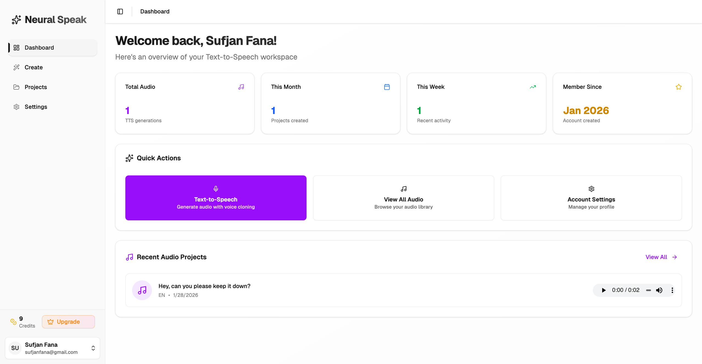
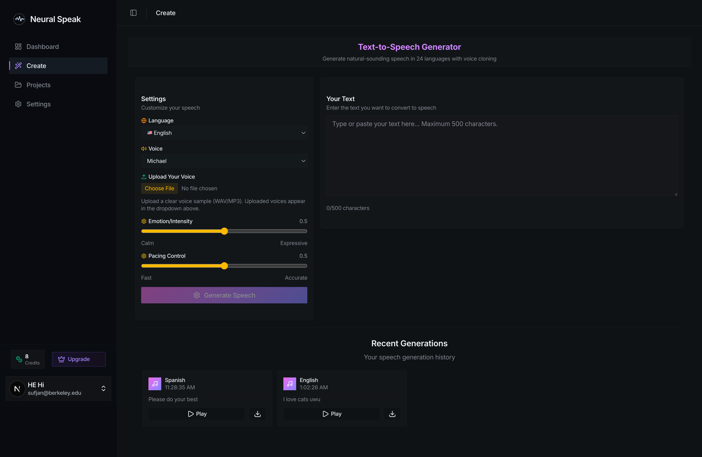
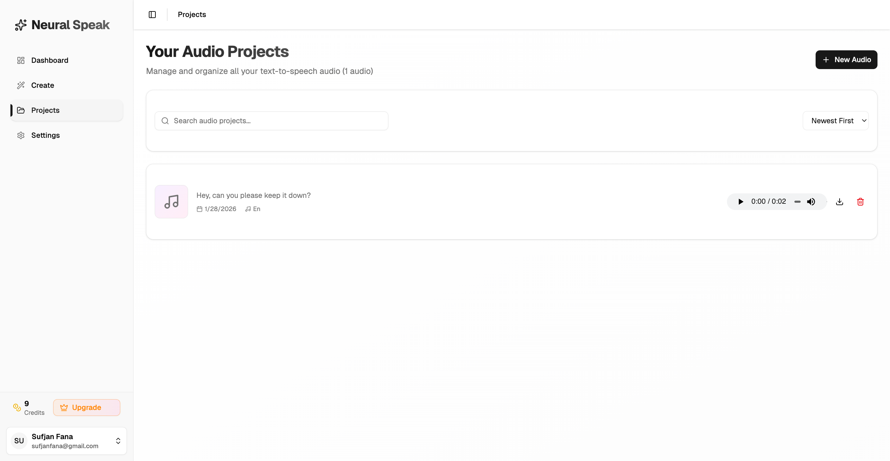
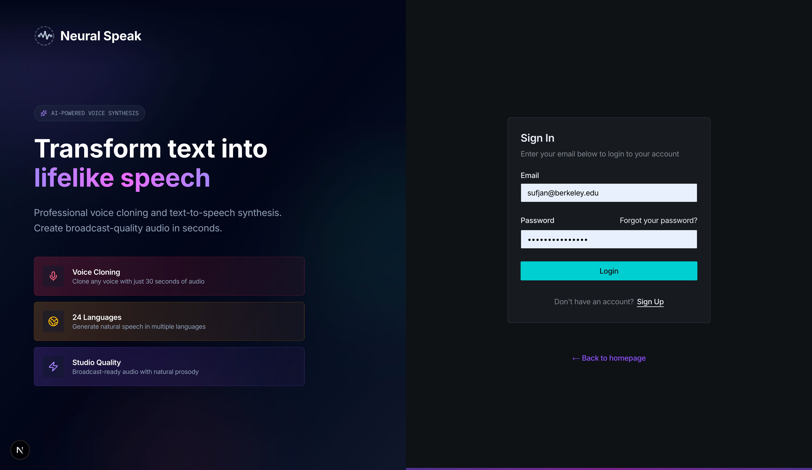

# Neural Speak

Production-ready, full-stack text-to-speech SaaS. Next.js 16 frontend, Python backend for serverless AI inference. Users can generate speech in multiple languages, clone voices, and manage their audio projects.

**Live:** https://neural-speak.vercel.app/

## Features

- Serverless TTS using the Chatterbox model
- Multi-language support with voice cloning
- Credits-based billing and subscriptions
- Email and social authentication
- Audio storage on S3, metadata in PostgreSQL
- Mobile-friendly responsive UI

## Screenshots

<p align="center">
  
</p>
<p align="center"><em>Dashboard — account overview and recent activity</em></p>

<p align="center">
  
</p>
<p align="center"><em>Create — generate speech with custom settings</em></p>

<p align="center">
  
</p>
<p align="center"><em>Projects — manage generated audio</em></p>

<p align="center">
  
</p>
<p align="center"><em>Home — product overview and primary CTA</em></p>

<p align="center">
  
</p>
<p align="center"><em>Login — secure authentication</em></p>

## Tech Stack

**Frontend:** Next.js 16, TypeScript, Tailwind CSS  
**Backend:** Python 3.11, Chatterbox TTS, PyTorch  
**Database:** PostgreSQL  
**Infrastructure:** AWS S3

## Project Structure

```
neural-speak/
├── frontend/
│   ├── src/
│   │   ├── app/          # Pages
│   │   ├── components/   # UI
│   │   ├── actions/      # Server actions
│   │   └── lib/          # Utils
│   └── prisma/           # Schema
└── backend/
    └── text-to-speech/   # TTS service
```

## Setup

Requires Node.js 18+, Python 3.11+, and accounts for the services listed below.

```bash
# Frontend
cd frontend && npm install

# .env (frontend/)
DATABASE_URL="..."
BETTER_AUTH_SECRET="..."
BETTER_AUTH_URL="http://localhost:3000"
POLAR_ACCESS_TOKEN="..."
POLAR_WEBHOOK_SECRET="..."
AWS_ACCESS_KEY_ID="..."
AWS_SECRET_ACCESS_KEY="..."
AWS_REGION="..."
AWS_S3_BUCKET_NAME="..."
MODAL_API_URL="..."
MODAL_API_KEY="..."
MODAL_API_SECRET="..."

# Database
npx prisma generate && npx prisma db push

# Backend
cd ../backend/text-to-speech
python3 -m venv venv && source venv/bin/activate
pip install -r requirements.txt
modal deploy tts.py

# Run
cd ../../frontend && npm run dev
```

## Usage

1. Sign up
2. Go to Create
3. Enter text, pick language/voice
4. Generate and download

## Services Used

- **Modal** for serverless GPU compute
- **Neon** for managed PostgreSQL
- **Prisma** for database ORM
- **Polar** for payments and subscriptions
- **Better Auth** for authentication

## License

MIT
